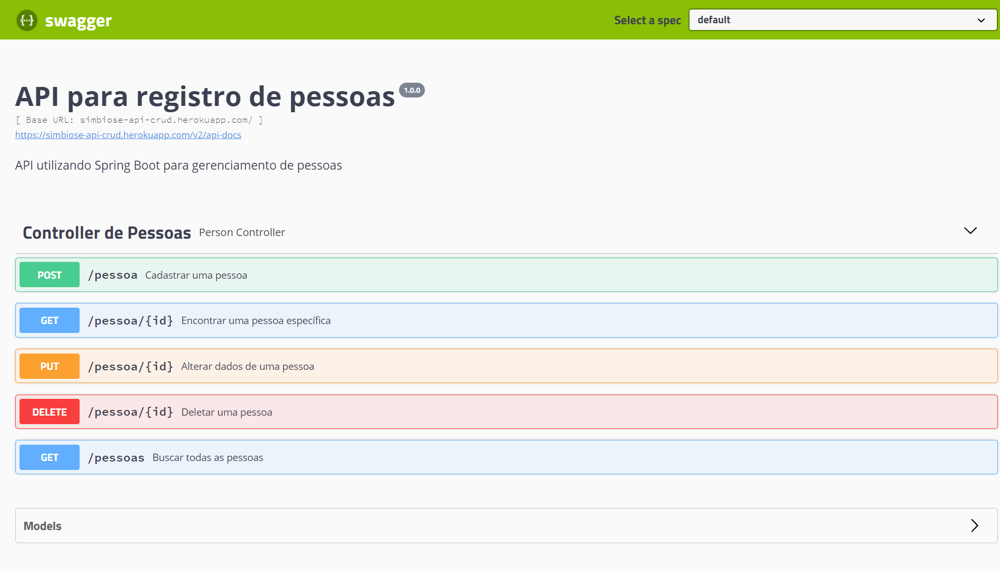

## API REST em Java com Spring Boot para gerenciamento de pessoas

### Screenshot

### Construído com

- Java 18.0.1.1
- Spring Framework
- PostgreSQL
- Swagger

API REST desenvolvida com Java e Spring Boot.

Por meio da API, são disponibilizados recursos para as operações de inserção, alteração, exclusão e obtenção de pessoas, um CRUD.

Por meio do endpoint "/pessoas", utilizando-se o método HTTP GET, é retornada uma listagem com todas as pessoas cadastradas.

Já o endpoint "/pessoa/{id}", método HTTP GET, que espera receber o ID na própria URL, é retornada uma pessoa específica.

Usando o método HTTP POST no endpoint "/pessoa", é preciso fornecer os dados da pessoa a ser cadastrada, no corpo da requisição, sendo eles o nome, email e data de nascimento.

No endpoint "/pessoa/{id}" com o método HTTP PUT, é preciso fornecer na URL o ID da pessoa, e os novos dados no corpo da requisição, a fim de atualizá-los no banco de dados.

Por fim, o endpoint "/pessoa/{id}", pelo método HTTP DELETE, é passado o ID da pessoa na própria URL, e caso exista, é excluída.

A aplicação retorna os erros com status code 404 caso a pessoa não exista, ou 400 caso o email informado já esteja sendo utilizado por outra pessoa já cadastrada.

Com a utilização do Spring Framework foi possível se beneficiar da Inversão de Controle via Injeção de Dependência fornecida pelo IoC Container, em que o próprio framework gerencia a instanciação de objetos utilizados como dependência em outra classe, reduzindo o acoplamento entre elas.

Para visualização de seu funcionamento, foi utilizado o Swagger, conforme a imagem acima.

## Execução

Foi realizado o deploy da aplicação em cloud na plataforma Heroku, por meio do link: https://simbiose-api-crud.herokuapp.com/swagger-ui.html

Antes de iniciar a aplicação, é preciso iniciar o container docker com a instância do PostgreSQL, onde são persistidos os dados.

Para isso é preciso, com o docker em funcionamento, executar no terminal o comando "docker run --name pessoa -p 5432:5432 -e POSTGRES_DB=pessoa -e POSTGRES_USER=admin -e POSTGRES_PASSWORD=password -d postgres:10-alpine".

Após, será necessário executar "docker start pessoa" no terminal para iniciar o container.

Enfim, para executar a aplicação, execute "mvn clean install" e depois o comando (mvn exec:java -D"exec.mainClass"="com.crudapi.crud.CrudApplication") no terminal.

## Autor

-   GitHub - Vinícius dos Santos Verissimo (https://github.com/viniciusdsv93)